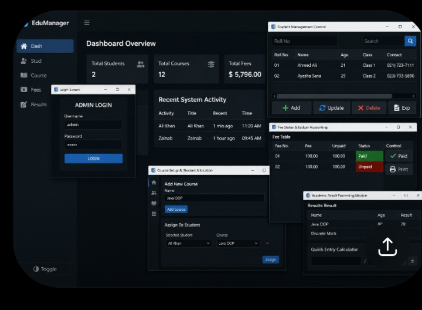

# 🎓 School Management System

A professional School Management System developed using Java Swing.

## ✨ Features

- Admin Login
- Dashboard
- Student Management
- Course Management
- Fee Management
- Result Management
- Search Students
- Export Student Report
- Dark Mode

## 🛠 Technologies

- Java
- Java Swing
- AWT
- JTable
- File Handling

## 🚀 How to Run

1. Download the project.
2. Open it in NetBeans, Eclipse, or IntelliJ IDEA.
3. Run `SchoolManagementSystem.java`.

## 👨‍💻 Author

Ahmer
Software Engineering Student
## 📸 Screenshots

Screenshots are available in the *screenshots* folder.
## 📸 Screenshot

## Author

*Ahmer*

GitHub: https://github.com/codewithahmer-pro
